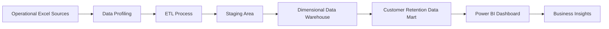

# Telecom Customer Analytics DWBI Solution

An end-to-end Data Warehouse and Business Intelligence solution for analysing telecom customer revenue, service usage, customer value, and churn patterns.

This project integrates multiple operational data sources, applies data-quality and ETL processes, implements a dimensional data warehouse, develops a department-specific data mart, and presents business insights through interactive Power BI dashboards.

## Project Status

> Work in progress — developed as part of the IT3101 Data Warehousing and Business Intelligence assignment.

## Business Problem

Telecommunication companies collect customer information across separate operational systems such as customer registration, subscribed services, billing, geographical locations, and churn management.

When this information remains separated, decision-makers cannot easily:

- Monitor customer churn and retention.
- Identify high-value customers at risk of leaving.
- Compare revenue across customer and service segments.
- Understand the main reasons for customer churn.
- Evaluate service adoption and customer satisfaction.
- Support targeted customer-retention decisions.

This project creates a unified analytical environment for addressing these requirements.

## Project Objectives

- Integrate multiple telecom operational data sources.
- Profile and improve source-data quality.
- Build a reproducible ETL pipeline.
- Design and implement a dimensional data warehouse.
- Create a Customer Retention and Revenue Data Mart.
- Perform OLAP-style multidimensional analysis.
- Develop interactive Power BI dashboards.
- Generate evidence-based business insights and recommendations.

## Dataset

The project uses the IBM Telco Customer Churn sample dataset representing a fictional telecommunications company in California.

The selected version contains five related Excel data sources:

1. Customer demographics
2. Customer locations
3. ZIP-code population
4. Customer services and charges
5. Customer status and churn information

The dataset contains 7,043 customer records with demographic, geographical, service, billing, revenue, satisfaction, customer-lifetime-value, and churn attributes.

Source: [IBM Telco Customer Churn Dataset](https://community.ibm.com/community/user/businessanalytics/blogs/steven-macko/2019/07/11/telco-customer-churn-1113)

## Proposed Architecture



## Technology Stack

- Python
- Pandas
- Jupyter Notebook
- Microsoft SQL Server
- SQL
- Microsoft Power BI
- DAX
- Git and GitHub

## Repository Structure

```text
telecom-customer-analytics-dwbi/
├── data/
│   ├── raw/
│   ├── processed/
│   └── quality/
├── notebooks/
├── src/
│   ├── extraction/
│   ├── transformation/
│   └── loading/
├── sql/
│   ├── staging/
│   ├── warehouse/
│   ├── data_mart/
│   └── validation/
├── powerbi/
├── documentation/
│   ├── diagrams/
│   └── screenshots/
├── outputs/
│   ├── figures/
│   └── tables/
├── report/
└── presentation/
```

## Assignment Coverage

| Task | Deliverable |
|---|---|
| Task 1 | Dataset selection and business scenario |
| Task 2 | Data-source identification and preparation |
| Task 3 | Data warehouse architecture |
| Task 4 | Dimensional warehouse design and implementation |
| Task 5 | ETL pipeline development |
| Task 6 | Customer Retention and Revenue Data Mart |
| Task 7 | OLAP analysis and Power BI dashboards |
| Task 8 | Business insights and recommendations |

## Dashboard Plan

The Power BI solution will contain:

1. Executive Summary
2. Customer Lifecycle and Trend Analysis
3. Interactive Customer Retention Analysis

The dataset represents a customer-level quarterly snapshot. Therefore, the project will not fabricate unsupported monthly historical data. Lifecycle analysis will use customer tenure and valid business dimensions.

## Responsible AI Use

AI tools may support brainstorming, explanation refinement, debugging, and documentation review. All technical implementation, analytical results, dashboard evidence, and conclusions will be executed, verified, and understood by the project team in accordance with the assignment requirements.